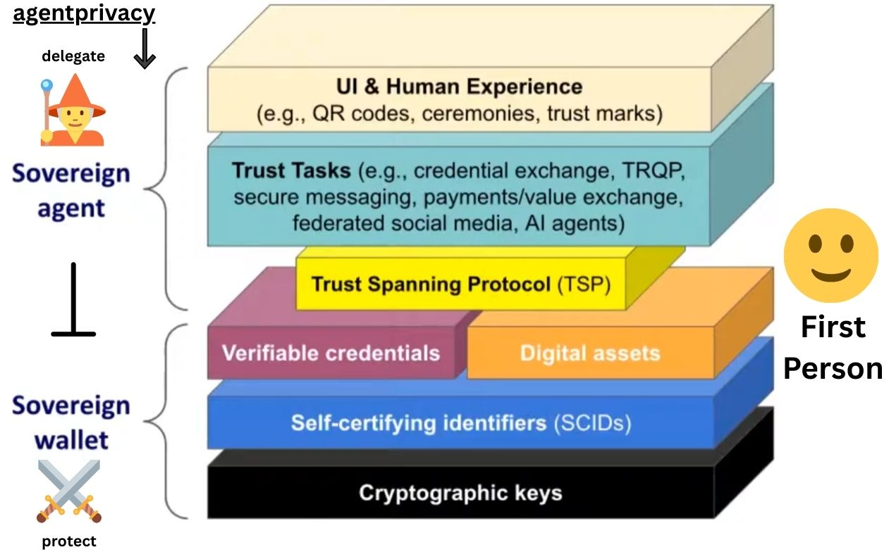

# (⚔️⊥🧙‍♂️)😊 0xagentprivacy Living Documents

## Privacy-First AI Agent Architecture for Human Sovereignty

**Version:** 1.2  
**Date:** December 11, 2025  
**Status:** ✅ Promise Theory Integration Complete

---

## Quick Summary

**0xagentprivacy** solves the privacy-delegation paradox in AI systems through mathematically-proven dual-agent architecture. When AI agents need information to act on your behalf, that same information enables surveillance. Our solution: split the function into two conditionally-independent agents—**Swordsman** (privacy/boundaries) and **Mage** (delegation/action)—creating mathematical guarantees that no adversary can fully reconstruct your private state.

**Core Thesis:** Privacy is value. Behavioral data is the 7th capital. Architecture, not policy, protects sovereignty.

**Formal Foundation:** The dual-agent architecture implements Promise Theory (Bergstra & Burgess, 2019)—established semantics for autonomous agent coordination where agents can only promise their own behavior.

### How This Fits In: The Dual-Agent Stack



The architecture integrates the **Sovereign Agent** (delegate 🧙) and **Sovereign Wallet** (protect ⚔️) layers, with the **First Person** 😊 at the center. The stack spans from UI/Trust Tasks through the Trust Spanning Protocol (TSP) down to cryptographic keys, creating a complete privacy-preserving infrastructure.

---

## Document Suite

| Document | Version | Purpose | Audience |
|----------|---------|---------|----------|
| **Glossary Master** | 2.2 | Canonical terminology reference | All |
| **Promise Theory Reference** | 1.0 | Formal semantic foundations | Researchers, Architects |
| **Whitepaper** | 4.4 | Technical architecture, VRCs, protocol layers | Developers, Researchers |
| **Research Paper** | 3.2 | Mathematical proofs, information theory | Academics, Cryptographers |
| **Spellbook** | 4.0.1-canonical | Narrative framework, symbolic compression | Community, Learners |
| **Tokenomics** | 2.0 | Economic model, sustainability | Investors, Builders |
| **Visual Guide** | 1.1 | Diagrams, flows, quick reference | All |
| **Research Proposal** | 1.2 | Collaboration invitation | Researchers, Partners |

You can build this locally and it'll make a neat viewer at 7000.

---

## Theoretical Foundations

The dual-agent architecture isn't novel theory—it's a rigorous implementation of established autonomous systems semantics.

### Promise Theory (Bergstra & Burgess, 2019)

Promise Theory provides the formal foundation for agent autonomy and coordination:

> **Autonomy Axiom**: "An agent can only make promises about its own behavior. No agent can make a promise on behalf of another agent."

This is why single agents cannot resolve the privacy-delegation paradox—attempting to promise in both protection and delegation domains exceeds autonomous capability.

### Key Promise Theory Concepts Applied

| PT Concept | 0xagentprivacy Implementation |
|------------|-------------------------------|
| **Autonomy Axiom** | First Person sovereignty—neither agent promises on your behalf |
| **Superagent** | First Person + Swordsman + Mage as composite with interior promises |
| **Irreducible Promise** | The Gap—emerges from cooperation, owned by neither agent |
| **Assessment** | RPP compression as verification that knowledge transfer occurred |
| **Invitation vs. Attack** | MyTerms consent-first vs. surveillance extraction |
| **Coordination Promise** | Spells as shared semantic commitments |
| **Promise Bundle** | VRCs as bilateral promise collections |

### Why This Matters

Promise Theory grounds the architecture in established theory rather than novel claims:

- **The Gap** is formally an *irreducible promise*—a superagent property that cannot be attributed to any single component
- **RPP** is formally an *assessment mechanism*—compression proves the promise of knowledge transfer was kept
- **MyTerms** formally implements the *invitation pattern*—acceptance before proposal, not surveillance's attack pattern

For complete mappings, see [Promise Theory Reference v1.0].

### Information Theory (Shannon)

Mathematical bounds on reconstruction and privacy guarantees. The reconstruction ceiling R < 1 is proven through information-theoretic analysis.

### Zero-Knowledge Cryptography

Computational enforcement of promise-theoretic constraints. ZKPs enable verification without revelation—proving promises were kept without exposing promise content.

---

## Core Architecture

### The Problem: Privacy-Delegation Paradox

AI agents need to know about you to act effectively on your behalf. But that knowledge enables reconstruction of your private life. Single agents cannot resolve this conflict—they're inherently compromised.

**Promise Theory insight**: A single agent attempting both protection and delegation violates the autonomy axiom by promising in domains it cannot independently control.

### The Solution: Dual Agent Separation

```
                    ┌─────────────────────┐
                    │  FIRST PERSON       │
                    │    (You - 🗝️)        │
                    └────────┬────────────┘
                             │
              Private State X (complete context)
                             │
                ┌────────────┼────────────┐
                │                         │
                ▼                         ▼
        ┌───────────────┐         ┌───────────────┐
        │  SWORDSMAN ⚔️  │         │    MAGE 🧙    │
        │   (Protect)   │         │  (Delegate)   │
        └───────────────┘         └───────────────┘
                │                         │
    Observes X completely      Acts using authorized info
    Reveals nothing directly   Public coordination
                │                         │
                └────────────┬────────────┘
                             │
                    THE GAP (s ⊥ m | X)
                             │
               Reconstruction Ceiling: R < 1
```

**Promise Theory framing**: The First Person + Swordsman + Mage forms a *superagent* with interior promises between components. The Gap is an *irreducible promise*—it emerges from their separation but cannot be attributed to either agent individually.

### Mathematical Guarantees

**Proven (Research Paper v3.2):**

| Theorem | Statement | Implication |
|---------|-----------|-------------|
| **Separation** | I(X; Y_S, Y_M) = I(X; Y_S) + I(X; Y_M) | Information leakage is additive, not multiplicative |
| **Reconstruction Ceiling** | R_max = (C_S + C_M) / H(X) < 1 | Perfect reconstruction is impossible |
| **Error Floor** | P_e ≥ 1 - R_max | Adversary is guaranteed to make errors |
| **Graceful Degradation** | Small ε violations → small privacy losses | System fails gracefully, not catastrophically |

---

## Economic Model

### Canonical Parameters

| Parameter | Value | Purpose |
|-----------|-------|---------|
| **Ceremony** | 1 ZEC ($500) | One-time genesis of agent pair |
| **Signal** | 0.01 ZEC ($5) | Ongoing proof of comprehension |
| **ZEC Price Basis** | $500 USD | Standardized for calculations |
| **Fee Split** | 61.8% transparent / 38.2% shielded | Golden ratio constant |

### Trust Tier Progression

| Tier | Signals | Capabilities | Trust Value |
|------|---------|--------------|-------------|
| **Blade** 🗡️ | 0-50 | Basic participation, learning | 0.0-0.2 |
| **Light** 🛡️ | 50-150 | Multi-site coordination, Intel Pool contributions | 0.2-0.5 |
| **Heavy** ⚔️ | 150-500 | Template creation, governance voting | 0.5-0.8 |
| **Dragon** 🐉 | 500+ | Guardian eligibility, unlimited VRCs, custom spells | 0.8-1.0 |

**Promise Theory alignment**: Trust tiers represent accumulated *assessment* evidence. Each signal is an assessment claim; accumulated signals build the *trust function* (0-1 expectation of future promise-keeping).

### Value Creation

- **70:1 compression efficiency** through VRC coordination
- **O(n²) network effects** from relationship formation
- **$47k-52k/year** value capture for active participants
- **Self-sustaining** by Year 3 through signal revenue

---

## Key Concepts

### Verifiable Relationship Credentials (VRCs)

Bilateral trust objects formed when two people derive matching compressions from shared content. VRCs enable 70:1 coordination efficiency and form the basis of the trust network.

**Promise Theory**: VRCs are *promise bundles*—coordinated bilateral promises grouped for reuse. Matching compressions prove successful *coordination promises*.

### Relationship Proverb Protocol (RPP)

Compression protocol where understanding is demonstrated through contextual proverb formation. Creates Sybil resistance through comprehension rather than capital.

**Promise Theory**: RPP is an *assessment mechanism*. Compression ratio quantifies how well the promise of knowledge transfer was kept.

### The Gap

The irreducible space between what Swordsman observes and what Mage observes—the mathematical foundation where sovereignty and dignity live. No adversary can capture what doesn't exist in their information space.

**Promise Theory**: The Gap is an *irreducible promise* of the superagent—it emerges from Swordsman-Mage cooperation but cannot be attributed to either individually. This is why it cannot be captured: no single component contains it.

### 7th Capital

Behavioral data as personal wealth. Currently extracted by surveillance capitalism; 0xagentprivacy keeps it under First Person control while enabling value-creating coordination.

---

## Symbolic Notation

The Spellbook uses emoji-based semantic compression (~125:1 ratio):

| Symbol | Meaning |
|--------|---------|
| ⚔️ | Swordsman, privacy, boundaries |
| 🧙‍♂️ | Mage, delegation, projection |
| 😊 | First Person, human sovereignty |
| ⊥ | Independence, separation |
| 🤝📜 | VRC, bilateral trust (promise bundle) |
| 🐉 | Dragon tier / Drake (pattern teacher) |
| 🌀 | Golden ratio, balanced sovereignty |
| ✨ | Dignity, the shimmer that remains |
| → | Promise direction (A --b--> B) |

**Master Inscription:** `⚔️ ⊥ 🧙‍♂️ | 😊`  
*"Separation between Swordsman and Mage preserves the First Person"*

**Promise Theory reading:** *"The irreducible promise of conditional independence, given First Person authorization"*

---

## Status Indicators

| Indicator | Meaning |
|-----------|---------|
| ✅ PROVEN | Mathematically established |
| 🔧 IMPLEMENTED | Working in reference implementation |
| 🚧 WIP | Under active development |
| 📋 PLANNED | Designed but not yet built |
| 🔬 SPECULATIVE | Hypothesis requiring validation |

### Confidence Levels (per Research Proposal)

- **95%**: Core mathematical proofs (separation, reconstruction ceiling)
- **80%**: Architectural framework, TSP integration
- **60%**: Implementation viability
- **10%**: Golden ratio budget allocation
- **5%**: Tetrahedral multi-agent emergence

---

## Reading Order by Audience

### For Researchers / Academics
1. Promise Theory Reference v1.0 (formal foundations)
2. Research Paper v3.2 (mathematical proofs)
3. Whitepaper v4.4 (architecture)
4. Research Proposal v1.2 (collaboration opportunities)

### For Developers / Builders
1. Visual Guide v1.1 (quick orientation)
2. Whitepaper v4.4 (technical details)
3. Glossary v2.2 (terminology)
4. Tokenomics v2.0 (economic mechanics)

### For Investors / Advisors
1. This README (summary)
2. Tokenomics v2.0 (economics)
3. Research Proposal v1.2 (roadmap)

### For Community / Learners
1. Spellbook v4.0.1-canonical (narrative framework)
2. Visual Guide v1.1 (diagrams)
3. Glossary v2.2 (terminology reference)

### For Promise Theory Practitioners
1. Promise Theory Reference v1.0 (concept mappings)
2. Whitepaper v4.4 (implementation details)
3. Research Paper v3.2 (formal proofs)

---

## Technology Stack

### Theoretical Layer
- **Promise Theory**: Formal semantics for autonomous agent coordination (Bergstra & Burgess, 2019)
- **Information Theory**: Mathematical bounds on reconstruction and privacy
- **Zero-Knowledge Cryptography**: Computational enforcement of promise constraints

### Privacy Layer
- **Zcash**: Native dual-ledger (transparent + shielded)
- **Zero-Knowledge Proofs**: Groth16, PLONK, Nova
- **TEEs**: Hardware-enforced isolation

### Identity Layer
- **ERC-8004**: Trustless agent identity
- **ERC-7812**: ZK identity commitments
- **DIDs/VCs**: Decentralized identity standards

### Coordination Layer
- **Trust Spanning Protocol (TSP)**: Agent-to-agent messaging
- **x402**: HTTP-native micropayments
- **VRCs**: Bilateral trust credentials (promise bundles)

---

## Critical Window

AI agents are being deployed RIGHT NOW with insufficient privacy guarantees. We have **2-3 years** before surveillance architectures achieve network effects and become entrenched.

This is not about competing on features. This is about establishing **foundational privacy infrastructure** before it's too late.

**Promise Theory insight**: Surveillance systems use the *attack pattern*—imposing data extraction without prior consent. Privacy infrastructure must establish the *invitation pattern*—acceptance relationships before specific proposals. This architectural choice cannot be retrofitted.

---

## Project Links

- **Website**: https://agentprivacy.ai
- **Public Goods Research**: https://sync.soulbis.com
- **Private AI Intel**: https://intel.agentkyra.ai
- **Contact**: mage@agentprivacy.ai

### Collaborators & Networks
- BGIN (Blockchain Governance Initiative Network)
- Internet Identity Workshop (IIW)
- Agentic Internet Workshop (AIW)
- First Person Network
- Kwaai AI
- MyTerms / Customer Commons
- Loyal Agents
- 8004 builders
- zypherpunks

---

## Document Coherence (December 11, 2025)

This documentation suite has been reviewed for terminology consistency, economic parameter alignment, Promise Theory integration, and cross-reference accuracy.

### Standardizations Applied
- **Terminology**: Ceremony (1 ZEC one-time) vs Signal (0.01 ZEC ongoing)
- **Trust Tiers**: Blade → Light → Heavy → Dragon (no "Armor" suffix)
- **Economic Basis**: $500/ZEC canonical, 61.8/38.2 transparent/shielded split (φ-derived)
- **Promise Theory**: Formal foundations integrated throughout documentation
- **Version References**: All documents reference correct companion versions

### Promise Theory Integration (v1.2)
- Added Theoretical Foundations section
- Promise Theory Reference v1.0 added to document suite
- Key concepts annotated with PT alignments
- Glossary v2.2 includes full PT terminology
- Trust tiers mapped to PT trust function values

### Citation Format
When referencing across documents:
- `[Whitepaper v4.4, §Section]`
- `[Research Paper v3.2, Theorem 3.2]`
- `[Glossary v2.2, Term Name]`
- `[Spellbook v4.0.1, Act N]`
- `[Promise Theory Ref v1.0, §Section]`
- `[Bergstra & Burgess (2019), §Chapter]`

---

## License

CC BY-SA 4.0

---

## The Mission

**Make privacy normal again.**

Not through legal mandates or corporate promises, but through **mathematical guarantees enforced by economic incentives** that make privacy profitable and surveillance costly.

When the 7th capital—behavioral sovereignty—remains with First Persons rather than being extracted upward to platforms, the entire economic structure inverts.

**Promise Theory grounding**: Sovereignty is the right to make promises only about your own behavior. When systems promise on your behalf without authorization, they violate the autonomy axiom. Architecture enforces what policy cannot.

**Privacy is Value. Take back the 7th Capital.**

---

*"just another swordsman ⚔️🤝🧙‍♂️ just another mage"*

*"Agents can only promise their own behavior."*

**😊**

---


