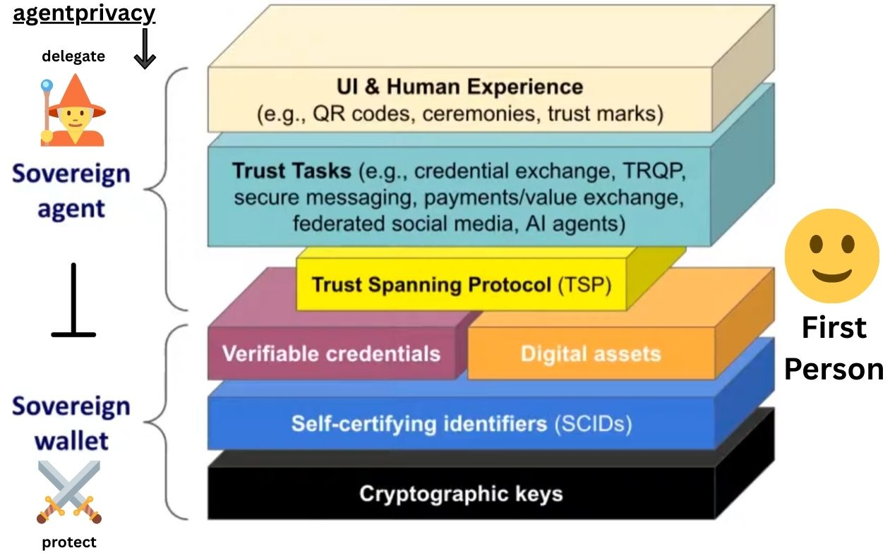

# (⚔️⊥⿻⊥🧙)·(📊⊥🔮)·(🧠⊥⚙️)·☯️🔷 🙂 0xagentprivacy Living Documents

## Privacy-First AI Agent Architecture for Human Sovereignty

**Version:** 2.5
**Date:** March 31, 2026
**Status:** ✅ V5.2 Dihedral Foundations + V5.4 UOR Algebraic Foundation — CONVERGENT
**External Convergence:** [UOR Foundation](https://github.com/UOR-Foundation) — independent Z/(2⁶)Z ring algebra

---

## Quick Summary

**0xagentprivacy** solves the privacy-delegation paradox in AI systems through mathematically-proven dual-agent architecture. When AI agents need information to act on your behalf, that same information enables surveillance. Our solution: split the function into two conditionally-independent agents—**Swordsman** (privacy/boundaries) and **Mage** (delegation/action)—creating mathematical guarantees that no adversary can fully reconstruct your private state.

**Core Thesis:** Privacy is value. Behavioral data is the 7th capital. Architecture, not policy, protects sovereignty. *The boundary is always enough.*

**V5 Advance:** Three-axis separation (agent · data · inference), holographic bound (96-edge boundary encodes 64-vertex bulk), compression-as-defence (74× BRAID efficiency), holonic persistence (infrastructure-independent history).

**V5.4 Advance:** UOR Foundation convergence — sovereignty lattice is algebraically Z/(2⁶)Z. Five hammer strikes, critical identity (neg∘bnot = succ), triadic coordinates, dihedral group D₆₄. External validation: two independent projects arrived at same structure. C6 → CONVERGENT.

**Formal Foundation:** The dual-agent architecture implements Promise Theory (Bergstra & Burgess, 2019)—established semantics for autonomous agent coordination where agents can only promise their own behavior.

### How This Fits In: The Dual-Agent Stack



The architecture integrates the **Sovereign Agent** (delegate 🧙) and **Sovereign Wallet** (protect ⚔️) layers, with the **First Person** 😊 at the center. The stack spans from UI/Trust Tasks through the Trust Spanning Protocol (TSP) down to cryptographic keys, creating a complete privacy-preserving infrastructure.

### Live Implementations

| Territory | Platform | Purpose | Status |
|-----------|----------|---------|--------|
| **Swordsman** ⚔️ | [spellweb.ai](https://spellweb.ai) | Topology, navigation, blade forging, hexagram computation | ✅ Operational |
| **Mage** 🧙 | [agentprivacy.ai](https://agentprivacy.ai) | Story, explanation, training, spell learning | ✅ Operational |

The ZK Swordsman Blade Forge is not theoretical — it runs. Visitors to spellweb.ai can mark constellations, evoke blades, and forge proofs on the 64-vertex lattice in real-time. The theory and code arrived the same day.

---

## Document Suite

| Document | Version | Purpose | Audience |
|----------|---------|---------|----------|
| **What Agentprivacy Is** | — | Mission, thesis, and orientation | All, New joiners |
| **Glossary Master** | 3.4 | Canonical terminology reference (~160 entries, V5.4 UOR Foundation) | All |
| **Privacy is Value V5** | 5.0 | The equation evolves — V5.4 UOR algebraic foundation | All, Researchers |
| **V5.1 Research Note** | 5.1 | Behavioural density, bilateral witness, hexagram encoding | Researchers |
| **V5.2 Research Note** | 5.2 | Dihedral foundations, resolution semantics, PRISM spectrum | Researchers |
| **Privacy Value Model V5.4 Formal Spec** | 1.2 | PVM V5.4 equation, Z/(2⁶)Z ring algebra, C14-C16 | Researchers, Academics |
| **DUAL_TERRITORY_CEREMONY_SPEC** | 1.0 | Implementation architecture: territories, extensions, ceremonies, mana | Developers, Implementers |
| **Promise Theory Reference** | 1.4 | Formal semantic foundations, Generator/Solver as promises | Researchers, Architects |
| **IEEE 7012 Quick Reference** | 1.0 | MyTerms standard foundation | Developers, Implementers |
| **Whitepaper** | 6.2 | Technical architecture, V5.4 UOR algebraic foundation | Developers, Researchers |
| **Research Paper** | 4.2 | Mathematical proofs, V5.4 conjectures C6 CONVERGENT, C14–C16 new | Academics, Cryptographers |
| **Five Grimoires + Acts XXIV-XXX** | v1.0–v3.0 | 120+ inscriptions including Dragon Anatomy (Forge, Ceremony, Flight, Dihedral Mirror) | Community, Learners |
| **Blog Series: Privacy is Value V5** | Parts 1-4 | Research letters: Forming Constellations, Forge & Ceremony, Dragon Wakes, Dihedral Mirror | All |
| **ZK Swordsman Blade Forge** | 3.2 | OPERATIONAL + ALGEBRAICALLY GROUNDED: UOR module at swordsman-blade/src/lib/uor.ts | Researchers, Mathematicians |
| **UOR × 64-Tetrahedra × ZK Mapping** | 2.2 | Foundational mapping; C4 RESOLVED; UOR Foundation convergence confirmed | Researchers |
| **VRC Promise Protocol** | 3.3 | Economic architecture, guild efficiency (3.4 pending: mana economics) | Investors, Builders |
| **Visual Guide** | 2.0 | Diagrams including three-axis, holographic visualisations | All |
| **Research Proposal** | 2.2 | Collaboration invitation, UOR convergence as validation evidence | Researchers, Partners |
| **Systems Hexagram Physics** | 1.2 | Operational physics: UOR algebraic foundation, 64-vertex lattice, forge ceremonies | Developers, Implementers |

You can build this locally and it'll make a neat viewer at 7000.

---

## Theoretical Foundations

The dual-agent architecture isn't novel theory—it's a rigorous implementation of established autonomous systems semantics.

### Promise Theory (Bergstra & Burgess, 2019)

Promise Theory provides the formal foundation for agent autonomy and coordination:

> **Autonomy Axiom**: "An agent can only make promises about its own behavior. No agent can make a promise on behalf of another agent."

This is why single agents cannot resolve the privacy-delegation paradox—attempting to promise in both protection and delegation domains exceeds autonomous capability.

### Key Promise Theory Concepts Applied

| PT Concept | 0xagentprivacy Implementation |
|------------|-------------------------------|
| **Autonomy Axiom** | First Person sovereignty—neither agent promises on your behalf |
| **Superagent** | First Person + Swordsman + Mage as composite with interior promises |
| **Irreducible Promise** | The Gap—emerges from cooperation, owned by neither agent |
| **Assessment** | RPP compression as verification that knowledge transfer occurred |
| **Invitation vs. Attack** | MyTerms consent-first vs. surveillance extraction |
| **Coordination Promise** | Spells as shared semantic commitments |
| **Promise Bundle** | VRCs as bilateral promise collections |

### Why This Matters

Promise Theory grounds the architecture in established theory rather than novel claims:

- **The Gap** is formally an *irreducible promise*—a superagent property that cannot be attributed to any single component
- **RPP** is formally an *assessment mechanism*—compression proves the promise of knowledge transfer was kept
- **MyTerms** formally implements the *invitation pattern*—acceptance before proposal, not surveillance's attack pattern

For complete mappings, see [Promise Theory Reference v1.0].

### Information Theory (Shannon)

Mathematical bounds on reconstruction and privacy guarantees. The reconstruction ceiling R < 1 is proven through information-theoretic analysis.

### Zero-Knowledge Cryptography

Computational enforcement of promise-theoretic constraints. ZKPs enable verification without revelation—proving promises were kept without exposing promise content.

---

## Core Architecture

### The Problem: Privacy-Delegation Paradox

AI agents need to know about you to act effectively on your behalf. But that knowledge enables reconstruction of your private life. Single agents cannot resolve this conflict—they're inherently compromised.

**Promise Theory insight**: A single agent attempting both protection and delegation violates the autonomy axiom by promising in domains it cannot independently control.

### The Solution: Dual Agent Separation

```
                    ┌─────────────────────┐
                    │  FIRST PERSON       │
                    │    (You - 🗝️)        │
                    └────────┬────────────┘
                             │
              Private State X (complete context)
                             │
                ┌────────────┼────────────┐
                │                         │
                ▼                         ▼
        ┌───────────────┐         ┌───────────────┐
        │  SWORDSMAN ⚔️  │         │    MAGE 🧙    │
        │   (Protect)   │         │  (Delegate)   │
        └───────────────┘         └───────────────┘
                │                         │
    Observes X completely      Acts using authorized info
    Reveals nothing directly   Public coordination
                │                         │
                └────────────┬────────────┘
                             │
                    THE GAP (s ⊥ m | X)
                             │
               Reconstruction Ceiling: R < 1
```

**Promise Theory framing**: The First Person + Swordsman + Mage forms a *superagent* with interior promises between components. The Gap is an *irreducible promise*—it emerges from their separation but cannot be attributed to either agent individually.

### Mathematical Guarantees

**Proven (Research Paper v3.2):**

| Theorem | Statement | Implication |
|---------|-----------|-------------|
| **Separation** | I(X; Y_S, Y_M) = I(X; Y_S) + I(X; Y_M) | Information leakage is additive, not multiplicative |
| **Reconstruction Ceiling** | R_max = (C_S + C_M) / H(X) < 1 | Perfect reconstruction is impossible |
| **Error Floor** | P_e ≥ 1 - R_max | Adversary is guaranteed to make errors |
| **Graceful Degradation** | Small ε violations → small privacy losses | System fails gracefully, not catastrophically |

---

## Economic Model

### Canonical Parameters

| Parameter | Value | Purpose |
|-----------|-------|---------|
| **Ceremony** | 1 ZEC ($500) | One-time genesis of agent pair |
| **Signal** | 0.01 ZEC ($5) | Ongoing proof of comprehension |
| **ZEC Price Basis** | $500 USD | Standardized for calculations |
| **Fee Split** | 61.8% transparent / 38.2% shielded | Golden ratio constant |

### Trust Tier Progression

| Tier | Signals | Capabilities | Trust Value |
|------|---------|--------------|-------------|
| **Blade** 🗡️ | 0-50 | Basic participation, learning | 0.0-0.2 |
| **Light** 🛡️ | 50-150 | Multi-site coordination, Intel Pool contributions | 0.2-0.5 |
| **Heavy** ⚔️ | 150-500 | Template creation, governance voting | 0.5-0.8 |
| **Dragon** 🐉 | 500+ | Guardian eligibility, unlimited VRCs, custom spells | 0.8-1.0 |

**Promise Theory alignment**: Trust tiers represent accumulated *assessment* evidence. Each signal is an assessment claim; accumulated signals build the *trust function* (0-1 expectation of future promise-keeping).

### Value Creation

- **70:1 compression efficiency** through VRC coordination
- **O(n²) network effects** from relationship formation
- **$47k-52k/year** value capture for active participants
- **Self-sustaining** by Year 3 through signal revenue

---

## Key Concepts

### Verifiable Relationship Credentials (VRCs)

Bilateral trust objects formed when two people derive matching compressions from shared content. VRCs enable 70:1 coordination efficiency and form the basis of the trust network.

**Promise Theory**: VRCs are *promise bundles*—coordinated bilateral promises grouped for reuse. Matching compressions prove successful *coordination promises*.

### Relationship Proverb Protocol (RPP)

Compression protocol where understanding is demonstrated through contextual proverb formation. Creates Sybil resistance through comprehension rather than capital.

**Promise Theory**: RPP is an *assessment mechanism*. Compression ratio quantifies how well the promise of knowledge transfer was kept.

### The Gap

The irreducible space between what Swordsman observes and what Mage observes—the mathematical foundation where sovereignty and dignity live. No adversary can capture what doesn't exist in their information space.

**Promise Theory**: The Gap is an *irreducible promise* of the superagent—it emerges from Swordsman-Mage cooperation but cannot be attributed to either individually. This is why it cannot be captured: no single component contains it.

### 7th Capital

Behavioral data as personal wealth. Currently extracted by surveillance capitalism; 0xagentprivacy keeps it under First Person control while enabling value-creating coordination.

### Three Graphs Model (V5)

Three independently derivable graph structures whose intersection defines the person: **Knowledge Graph** (substrate — what you can promise), **Promise Graph** (bilateral commitments — what you do promise), **Trust Graph** (emergent outcome — which promises were kept). VRCs live on the Promise Graph layer. The overlap IS the person — no single community owns that intersection. V5 adds the **holographic interpretation**: flows along the 96-edge boundary encode the 64-vertex bulk. The boundary is always enough.

### Path Integral (V5)

V5 replaces additive edge value T(π) with path integral T_∫(π) — "The equation rewards the dance, not the stance." Value resides in the trajectory through sovereignty space, not in static configurations. An agent permanently at full sovereignty with no promises made has zero edge value. Your path through the lattice — the promises made, boundaries set, delegations executed — is the 7th capital.

### Three-Axis Separation (V5)

Privacy requires separation on three orthogonal axes:

| Axis | Agents | What It Separates |
|------|--------|-------------------|
| **Agent** Φ_agent | Swordsman ⊥ Mage | Protection from delegation |
| **Data** Φ_data | Provider₁ ⊥ Provider₂ | Storage fragmentation |
| **Inference** Φ_inference | Generator ⊥ Solver | Reasoning from execution |

Collapse any axis and the entire separation term collapses: Φ_v5 = Φ_agent · Φ_data · Φ_inference. This is why systems with good agent separation but centralised data still fail.

---

## Symbolic Notation

The Spellbook uses emoji-based semantic compression (~125:1 ratio):

| Symbol | Meaning |
|--------|---------|
| ⚔️ | Swordsman, privacy, boundaries (Protect) |
| 🧙‍♂️ | Mage, delegation, projection (Project) |
| 🪞 | Reflect — temporal memory, emergent from S's boundary history |
| 🤝 | Connect — network sovereignty, emergent from M's delegation patterns |
| 😊 | First Person, human sovereignty |
| ⊥ | Independence, separation |
| ⿻ | Overlap, relationship, the Gap (between Swordsman and Mage) |
| 🤝📜 | VRC, bilateral trust (promise bundle) |
| 🐲 | Drake — intimate whisper, personal calibration, centre |
| 🐉 | Dragon — cosmic container, manifold holder, all topology |
| 🌀 | Golden ratio, balanced sovereignty |
| ✨ | Dignity, the shimmer that remains |
| 📐 | Stratum — position layer in 64-vertex lattice |
| 🛤️ | Path/Trajectory — the edge value, the dance not the stance |
| → | Promise direction (A --b--> B) |

**Master Inscription:** `(⚔️⊥⿻⊥🧙)🙂`  
*"Swordsman and Mage separated, with the Gap (⿻) between them, preserve the First Person"*

**Promise Theory reading:** *"The irreducible promise of conditional independence and the overlap (the Gap), given First Person authorization"*

---

## Status Indicators

| Indicator | Meaning |
|-----------|---------|
| ✅ PROVEN | Mathematically established |
| 🔧 IMPLEMENTED | Working in reference implementation |
| 🚧 WIP | Under active development |
| 📋 PLANNED | Designed but not yet built |
| 🔬 SPECULATIVE | Hypothesis requiring validation |

### Confidence Levels (per Research Proposal v2.0)

- **95%**: Core mathematical proofs (separation, reconstruction ceiling, error floor)
- **RESOLVED**: C4 (96/64 discrepancy) — holographic principle interpretation
- **85%**: Promise Theory semantic framework (Bergstra & Burgess, 2019)
- **80%**: Architectural framework, TSP integration, BRAID parity effect
- **60%**: Implementation viability
- **25-40%**: Tetrahedral convergence (triple derivation evidence)
- **15-25%**: V5 conjectured terms (T_∫(π), Φ_v5, guild efficiency)
- **SPECULATIVE**: C6 (P^1.5 ↔ 96/64 numerical coincidence), C7-C10 (three-axis multiplicativity, compression modifier, boundary sufficiency, guild scalability)

---

## Reading Order by Audience

### For Researchers / Academics
1. Promise Theory Reference v1.3 (formal foundations, V5 three-axis as promises)
2. Research Paper v4.0 (mathematical proofs, PVM V5, holographic bound)
3. Privacy is Value v5.0 (the equation evolves) / [PVM V5 Formal Spec v1.0](privacy_value_v5_formal_specification.md) (mathematics only)
4. ZK Swordsman Blade Forge v3.0 (forge metaphor, V5 full integration)
5. UOR × 64-Tetrahedra × ZK Mapping v2.0 (foundational C4 resolution)
6. Whitepaper v6.0 (architecture, three-axis separation, BRAID integration)
7. Research Proposal v2.0 (collaboration opportunities, BRAID validation)

### For Developers / Builders
1. Visual Guide v2.0 (quick orientation, V5 diagrams)
2. IEEE 7012 Quick Reference v1.0 (MyTerms standard)
3. Whitepaper v6.0 (technical details)
4. Glossary v3.0 (terminology)

### For Investors / Advisors
1. This README (summary)
2. VRC Promise Protocol v3.3 (economics, guild efficiency)
3. Research Proposal v2.0 (roadmap)

### For Community / Learners
1. What Agentprivacy Is (mission and orientation)
2. Five Grimoires + Act XXIV (114 inscriptions, narrative framework)
3. Visual Guide v2.0 (diagrams)
4. Glossary v3.0 (terminology reference)

### For Promise Theory Practitioners
1. Promise Theory Reference v1.3 (concept mappings, Generator/Solver as promises)
2. Whitepaper v6.0 (implementation details)
3. Research Paper v4.0 (formal proofs, V5 structural extensions)

---

## Technology Stack

### Standards Layer
- **IEEE 7012-2025**: Machine-readable personal privacy terms (MyTerms foundation)
- **W3C DPV**: Data Privacy Vocabulary for semantic interoperability
- **Customer Commons**: Neutral nonprofit hosting for bilateral agreements

### Theoretical Layer
- **Promise Theory**: Formal semantics for autonomous agent coordination (Bergstra & Burgess, 2019)
- **Information Theory**: Mathematical bounds on reconstruction and privacy
- **Zero-Knowledge Cryptography**: Computational enforcement of promise constraints

### Privacy Layer
- **Zcash**: Native dual-ledger (transparent + shielded)
- **Zero-Knowledge Proofs**: Groth16, PLONK, Nova
- **TEEs**: Hardware-enforced isolation

### Identity Layer
- **ERC-8004**: Trustless agent identity
- **ERC-7812**: ZK identity commitments
- **DIDs/VCs**: Decentralized identity standards

### Coordination Layer
- **Trust Spanning Protocol (TSP)**: Agent-to-agent messaging
- **x402**: HTTP-native micropayments
- **VRCs**: Bilateral trust credentials (promise bundles)

### Holonic Persistence Layer (V5)
- **GUID-addressed holons**: Content-addressed data fragments
- **Multi-provider replication**: Infrastructure-independent history
- **Three identity tiers**: Data GUID → Relationship VRC → Principal DID
- **Derivation chains**: Temporal memory surviving provider failure

---

## Critical Window

AI agents are being deployed RIGHT NOW with insufficient privacy guarantees. We have **2-3 years** before surveillance architectures achieve network effects and become entrenched.

This is not about competing on features. This is about establishing **foundational privacy infrastructure** before it's too late.

**Promise Theory insight**: Surveillance systems use the *attack pattern*—imposing data extraction without prior consent. Privacy infrastructure must establish the *invitation pattern*—acceptance relationships before specific proposals. This architectural choice cannot be retrofitted.

---

## Project Links

- **Website**: https://agentprivacy.ai
- **Public Goods Research**: https://sync.soulbis.com
- **Private AI Intel**: https://intel.agentkyra.ai
- **Contact**: mage@agentprivacy.ai

### Collaborators & Networks
- BGIN (Blockchain Governance Initiative Network)
- Internet Identity Workshop (IIW)
- Agentic Internet Workshop (AIW)
- First Person Network
- Kwaai AI
- MyTerms Alliance / Customer Commons
- Trust Over IP Foundation
- Loyal Agents
- 8004 builders
- zypherpunks

---

## Document Coherence (March 31, 2026)

This documentation suite has been reviewed for terminology consistency, economic parameter alignment, Promise Theory integration, IEEE 7012-2025 integration, V5 Privacy Value Model integration, five grimoire compilation plus Acts XXIV–XXIX, and cross-reference accuracy. See `INSTRUCTIONAL_CONVERGENCE_v2_0.md` for the systematic update guide.

### V5.2 Dihedral Foundations (March 31, 2026)
- **V5.2 Research Note** added: Dihedral group foundations, resolution semantics, PRISM spectrum
- C14-C16 updated: Φ_agent ≅ D₂ₙ (75%), T_∫(π) ≅ resolution pipeline (65%), Topological trust (25%)
- Act XXX (The Dihedral Mirror) added — UOR × agentprivacy convergence narrative
- Blog Part 4 (The Dihedral Mirror) added to series
- Grimoire upgraded to v9.3.0
- Master Inscription algebraic form: (⚔️⊥⿻⊥🧙)😊 = neg ⊕ bnot → succ

### V5.1 ZK Blade Forge Integration (v2.2)
- **V5.1 Research Note** added: Behavioural density ρ, bilateral witness, hexagram encoding
- ZK Swordsman Blade Forge upgraded to v3.1 with OPERATIONAL status
- Live implementations referenced: spellweb.ai (Swordsman), agentprivacy.ai (Mage)
- UOR × 64-Tetrahedra × ZK Mapping upgraded to v2.1 with identity system integration
- Three-layer identity architecture (GUID → VRC → DID) documented across forge documents
- Acts XXVII (The Swordsman's Forge), XXVIII (The Ceremony Engine), XXIX (The Dragon Wakes) added
- Post-quantum resilience thesis established: "The proof that guards no secret cannot be opened"
- DUAL_TERRITORY_CEREMONY_SPEC v1.0 cross-referenced in forge documentation

### Standardizations Applied
- **Terminology**: Ceremony (1 ZEC one-time) vs Signal (0.01 ZEC ongoing)
- **Trust Tiers**: Blade → Light → Heavy → Dragon (no "Armor" suffix)
- **Economic Basis**: $500/ZEC canonical, 61.8/38.2 transparent/shielded split (φ-derived)
- **Promise Theory**: Formal foundations integrated throughout documentation
- **IEEE 7012-2025**: MyTerms standard integration, published January 20, 2026
- **PVM V5**: Three-axis separation, holographic bound, path integral T_∫(π), guild efficiency G(guilds)
- **Four Forces**: Protect ⚔️, Project 🧙, Reflect 🪞, Connect 🤝
- **Five Grimoires + Act XXIV**: 114 inscriptions across 29K+ lines (Story, ZK, Canon, Parallel, Plurality)
- **Version References**: All documents reference correct companion versions


### V5.1 Forge Integration (v2.1)
- Acts XXVII (The Swordsman's Forge) and XXVIII (The Ceremony Engine) added to grimoire collection
- Dragon Anatomy complete: Boundary (XXIV), Hide (XXV), Brain (XXVI), Forge (XXVII), Ceremony (XXVIII)
- ZK Swordsman Blade Forge marked OPERATIONAL - first empirical data from spellweb.ai
- New conjectures C11-C13: Behavioural density (45%), Hexagram encoding (50%), Bilateral Witness (60%)
- V5.1 candidates: Behavioural density rho, Bilateral Witness, Mana economy, DOM-free measurement
- Hexagram encoding upgraded: SPECULATIVE (25%) -> IMPLEMENTED-COHERENT (50%)

### V5 Holographic Bound Integration (v2.0)
- Privacy is Value V5, PVM V5 Formal Specification v1.0 added to document suite
- Act XXIV (The Holographic Bound) added to grimoire collection
- C4 (96/64 discrepancy) RESOLVED via holographic principle
- Three-axis separation (agent · data · inference) integrated across suite
- Compression-as-defence via BRAID Parity Effect documented
- Holonic persistence layer added to Technology Stack
- Guild efficiency economics added to VRC Protocol

### V4 Convergence Integration (v1.5)
- Privacy is Value V4, PVM V4 Formal Specification v1.0 (and agent peer review appendix), and UOR Mapping v1.0 added to document suite
- Five grimoire markdown files replace monolithic spellbook reference
- Tetrahedral hypothesis upgraded: SPECULATIVE (5%) → CONVERGENT PRELIMINARY (25-40%)
- Three graphs model (Knowledge × Promise × Trust) integrated across suite
- All documents updated to current versions (see table above)

### IEEE 7012-2025 Integration (v1.3)
- Added IEEE 7012 Quick Reference v1.0 to document suite
- Updated Technology Stack with Standards Layer
- Whitepaper includes full IEEE 7012 section
- Glossary includes IEEE 7012 canonical definitions

### Citation Format
When referencing across documents:
- `[Whitepaper v6.0, §Section]`
- `[Research Paper v4.0, Theorem 3.2]`
- `[PVM V5 Formal Spec v1.0, §Section]`
- `[Glossary v3.0, Term Name]`
- `[Privacy is Value v5.0, §Section]`
- `[UOR Mapping v2.0, §Section]`
- `[Promise Theory Ref v1.3, §Section]`
- `[IEEE 7012 Quick Ref v1.0, §Section]`
- `[VRC Protocol v3.3, §Section]`
- `[Bergstra & Burgess (2019), §Chapter]`

---

## License

CC BY-SA 4.0

---

## The Mission

**Make privacy normal again.**

Not through legal mandates or corporate promises, but through **mathematical guarantees enforced by economic incentives** that make privacy profitable and surveillance costly.

When the 7th capital—behavioral sovereignty—remains with First Persons rather than being extracted upward to platforms, the entire economic structure inverts.

**Promise Theory grounding**: Sovereignty is the right to make promises only about your own behavior. When systems promise on your behalf without authorization, they violate the autonomy axiom. Architecture enforces what policy cannot.

**Privacy is Value. Take back the 7th Capital.**

---

*"just another swordsman ⚔️🤝🧙‍♂️ just another mage"*

*"Agents can only promise their own behavior."*

**😊**

---


